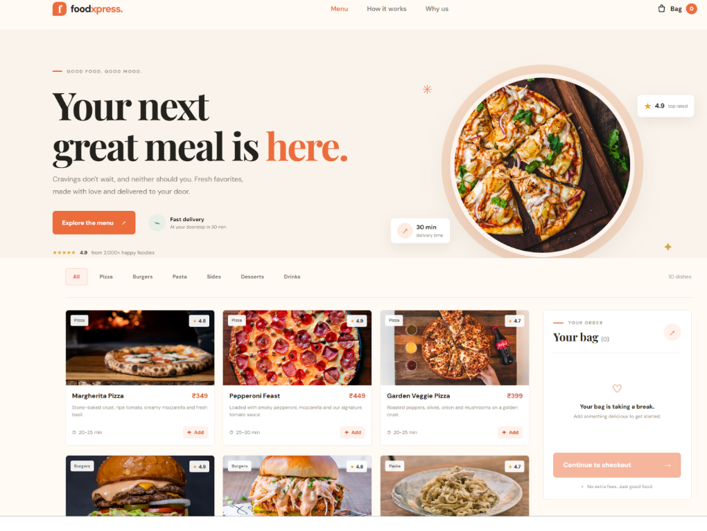

# FoodXpress

A responsive food ordering app with an HTML/CSS/JavaScript frontend, an Express REST API, and a MySQL database.

## Screenshot

## Live Demo

[▶ Play the FoodXpress demo](./public/%F0%9F%9A%80%20Live%20Demo%20%E2%80%94%20FoodXpress.mp4)

## Features

- Browse the restaurant menu, search dishes, and filter by category.
- Add dishes to a shopping cart and adjust quantities.
- Place an order with contact and delivery details.
- Store orders and order items in MySQL; the server calculates totals from trusted menu prices.

## Requirements

- Node.js 18 or later
- MySQL 8 or later

## Run locally

1. Make sure the MySQL service is running and the database and tables have been created by running `db/schema.sql` in MySQL.
2. Copy `.env.example` to `.env` and enter your MySQL connection details.
3. Open a terminal in this project folder and install dependencies. In Windows PowerShell, use `npm.cmd install`; in Command Prompt or macOS/Linux, use `npm install`.
4. Start the app. In Windows PowerShell, use `npm.cmd start`; in Command Prompt or macOS/Linux, use `npm start`. For Node's watch mode, use `npm.cmd run dev` in PowerShell or `npm run dev` in other terminals.
5. Open [http://localhost:3000](http://localhost:3000) in your browser. Do not open `public/index.html` directly; the frontend needs the Express server for its API requests.

If the app does not start, check the terminal output. A PowerShell error mentioning that scripts are disabled means you should use the `npm.cmd` commands above. A database connection error usually means MySQL is stopped or the credentials in `.env` do not match your MySQL account.

The menu is seeded by the schema script. The API is served from the same origin as the frontend:

- `GET /api/menu` — list menu items; optionally filter with `?category=Pizza` or `?search=pasta`.
- `POST /api/orders` — create an order. Send `customerName`, `phone`, `address`, and an `items` array of `{ "menuItemId": 1, "quantity": 2 }`.
- `GET /api/orders/:id` — retrieve an order and its items.

## Database configuration

The application reads `DB_HOST`, `DB_PORT`, `DB_USER`, `DB_PASSWORD`, and `DB_NAME` from `.env`. It does not create databases automatically; initialize the schema first. Do not commit `.env` or real credentials.
